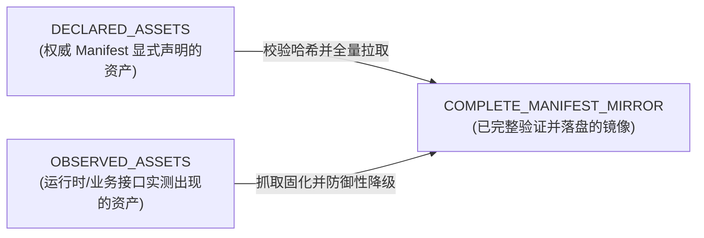

# BlaBla 静态资源现状审计与缺口分析报告

本文档为 `astrbot_plugin_nikke` 在独立分支 `prep/blabla-static-assets` 上的官方静态资源审计与镜像准备基线文档。

---

## 1. 审计背景与任务目标

在当前的 NIKKE 插件与 BlaBlaLink 生态中，下游渲染模块（包括角色卡片、阵容小头像卡片、联盟突袭总览卡片、指挥官档案等）严重依赖静态视觉素材。
过去的实现中，部分资源依赖外部第三方 CDN（如 GitHub raw `Nikke-db.github.io`），部分依赖动态计算但未落盘镜像的官网地址，缺乏统一的本地静态镜像与离线 Resolver 体系。

本次任务目标为：
1. 全面审计现有代码库中的静态资源登记、脚本与 Resolver。
2. 逆向分析 BlaBlaLink 官网前端 bundle 与 CDN 合同，发现权威 Manifest 与 URL 计算规则。
3. 盘点所有声明的静态资源，建立机器可读的静态资源清单与容量预估。
4. 开发本地化镜像同步脚本，将首批关键素材（阵容小头像、皮肤头像、通用属性/职业/武器/企业/Burst/品级图标、装备、魔方、珍藏品等）拉取并安全持久化。
5. 实现高内聚、纯本地、零网络且具备严格 Fallback 策略的 `LineupPortraitResolver` 与 `BossAssetResolver`。
6. 为下游 T2I 渲染开发提供清晰对接契约。

---

## 2. 代码库现有静态资产与 Resolver 审计

### 2.1 现有静态 JSON 注册表（`assets/` 目录）

| 文件名 | 条目数量 / 大小 | 核心 Schema / 字段 | 现状评估 |
| :--- | :--- | :--- | :--- |
| `character_master.json` | 200 角色 | `id`, `battle_tid_prefix`, `resource_id`, `name_code`, `character_key`, `spine_asset_id`, `class`, `weapon`, `element`, `burst`, `corporation`, `rare` | 官方 200 角色基础主数据完备，已对齐 `resource_id` 与 `name_code`。 |
| `costumes.json` | 40 皮肤 | `costume_id`, `character_resource_id`, `spine_asset_id`, `costume_name`, `source`, `source_sha256` | **严重滞后**：仅收录 40 款早期皮肤；官网权威清单已有 178 款皮肤。 |
| `cubes.json` | 14 魔方 | `tid`, `resource` | 覆盖现有 14 个和谐魔方，映射到 `icon/equip/{resource}.webp`。 |
| `favorite_items.json` | 33 珍藏品 | `tid`, `resource` | 覆盖现有 33 款珍藏品，映射到 `icon/favoriteitem/{resource}.webp`。 |
| `equipment.json` | 124 装备 | `equipment_id`, `resource` | 装备映射表，映射到 `icon/equip/icn_equipment_*`。 |
| `character_aliases.json` | 中英文角色别名表 | 别名字典 | 用于用户指令模糊匹配，非图像资产。 |
| `sources.json` | 资产下载映射表 | `relative_path` -> `cdn_url` | 历史预置的部分 URL 映射，多指向 GitHub raw CDN。 |
| `spine_manifest.json` | Spine 预渲染记录 | 预渲染哈希与角色对照 | 针对 Spine 角色立绘。 |

### 2.2 现有 Resolver 与代码边界

#### A. `asset_manager.py`
- **核心职责**：
  - 管理卡片渲染资产的内存与磁盘缓存；
  - 实现了官网资源的精确混淆哈希算法 `AssetManager.game_resource_url(path)`（基于 6 个大素数与 djb2 散列生成 2 字母 + 2 位数字两级桶路径与 MD5 散列文件名）；
  - 包含装备、珍藏品、魔方、元素、企业、武器、Burst 等图标的获取与 Fallback 机制；
  - 包含单任务最长 6s、卡片并发总超时 6s 的异步预取线程池与单飞并发锁 (`_InflightAsset`)；
  - 包含 600x900 Spine 预渲染立绘查询与中性程序几何占位图绘制。
- **边界与限制**：
  - **无阵容小头像（Lineup Compact Portrait）支持**：没有针对 `si` 家族（128x128 紧凑圆形/方形头像）的解析接口，目前仅支持 600x900 的全身/半身 Spine 肖像；
  - **无 Boss/Monster 图解析支持**：`union_raid_renderer.py` 完全未接入 `asset_manager`，仅绘制纯几何线框；
  - **外部 CDN 污染**：武器与企业图标仍回退至 `https://raw.githubusercontent.com/Nikke-db/...`，元素图标硬编码指向 `www.blablalink.com/...`，热路径未做到 100% 本地镜像保证。

#### B. `local_spine_resolver.py`
- **核心职责**：
  - 纯只读定位本地检出的 Nikke-db Spine 骨骼 (`.skel`)、图集 (`.atlas`) 与贴图 (`.png`)；
  - 提供路径穿越防护、UTF-8-SIG 校验、多纹理页完整性检查与 4.0/4.1 版本探测；
  - 保证 100% 离线、零网络、零外部子进程。
- **边界与限制**：
  - 严格作用于骨骼动效，完全不参与 WebP/PNG 静态图的加载、解算或阵容头像拼装。

---

## 3. 需求对比与核心资产缺口分析

对比下游 T2I 渲染（阵容图、推图攻略卡、公会突袭总览卡）的实际需求，目前代码库存在以下关键缺口：

| 资产类别 | 需求规格 | 现有代码状态 | 核心缺口 | 解决路线 |
| :--- | :--- | :--- | :--- | :--- |
| **NIKKE 紧凑小头像** | 128x128 RGBA WebP/PNG (`si` 家族) | 完全缺失 | 无 `si` 头像本地存储，无通过 `tid` / `resource_id` 解析 `si` 路径的 Resolver | 从官网 CDN 镜像 200 个默认 `si` 头像，建立 `LineupPortraitResolver` |
| **Costume 紧凑小头像** | 128x128 RGBA WebP/PNG (`si` 家族) | 完全缺失（`costumes.json` 仅 40 款） | 缺少 178 款皮肤头像文件及完整 `costume_id` -> `costume_index` 映射 | 从 `nikke_list_zh-TW_v2.json` 导出完整 178 款皮肤映射，镜像全部 `si` 皮肤头像 |
| **Boss / Monster 图像** | 突袭卡片背景/徽章，`monster_full/full_{icon_id}.webp` | 完全缺失 | 无 Boss 图像库，无 `boss_id` / `icon_id` 映射与 Resolver | 建立 `BossAssetResolver`，规范 `icon_id` 命中与防御性 Fallback 策略 |
| **属性图标 (Element)** | 63x73 PNG (fire/water/wind/iron/electronic) | 依赖在线 HTTP | 未落盘至本地持久化目录，网络抖动会导致出卡破图 | 下载 5 种属性图标至本地静态资产库，实现本地直读 |
| **武器图标 (Weapon)** | 80x80 PNG (AR/MG/RL/SG/SMG/SR) | 依赖 GitHub raw CDN | 外部 CDN 访问慢且不稳定，热路径违规发起外网请求 | 从官网前端静态资源或本地固化 6 大武器图标 |
| **企业图标 (Corporation)** | 128x128 / 400x400 (Elysion/Missilis/Tetra/Pilgrim/Abnormal) | 依赖 GitHub raw CDN | 外部 CDN 访问慢且不稳定 | 镜像官网 `atlas_common_corp` 高清矢量/PNG 图标 |
| **Burst 阶段图标** | 128x128 WebP (icn_burst_01~03, all) | 依赖在线计算 | 未落盘本地 | 镜像官网 `atlas_common_class` Burst 图标 |
| **品级与职业图标** | 188x73 (SSR/SR/R), 256x256 (Attacker/Defender/Supporter) | 缺失 | 未登记与未镜像 | 镜像官网 `ele_grade_icon_*` 与 `icn_class_*` |

---

## 4. 权威来源发现与逆向验证结论

通过逆向分析 BlaBlaLink 生产环境入口脚本 `index-BgvnrvAf.js` 及各功能模块 Bundle，已 100% 确认以下事实：

1. **CDN 混淆哈希规则确认**：
   `AssetManager.game_resource_url(path)` 算法与 BlaBlaLink 前端 `getIngameResourceUrl` 字节级一致。
2. **小头像命名规则确认**：
   前端源码中明确定义：
   ```javascript
   SM_CHARACTER_URL = ee => {
     let { skin_index: te = 0, resource_id: re } = ee;
     return getIngameResourceUrl(`/character/si/si_c${patch(re, 3)}_${patch(te, 2)}_s.${suffix}`);
   }
   ```
   尺寸为 **128x128 RGBA**，默认皮肤 `costume_index = 0`，换装皮肤从 `01` 开始递增。
3. **半身与全身立绘命名规则确认**：
   - 中型立绘（`mi` 家族）：`/character/mi/mi_c{resource_id:03d}_{costume_index:02d}_s.webp` (256x512)
   - 全身立绘（`full` 家族）：`/character/full/c{resource_id:03d}_{costume_index:02d}.webp` (2048x2048)
4. **Union Raid Boss 图像合同确认**：
   `union-BCS1AaWy.js` 中渲染 Boss 卡片所调用的接口为：
   ```javascript
   src: ICONS_URL({ path: 'monster_full', name: 'full_' + icon_id })
   ```
   即 `/icon/monster_full/full_{icon_id}.webp`。
5. **权威 JSON Manifest 确认**：
   - 角色与全量皮肤表：`/character/zh-tw/nikke_list_zh-TW_v2.json`
   - 头像映射表：`/character/character_avatar_map.json` (381 条记录)
   - 战斗 ID / 突破阶级映射表：`/character/character_id_map.json` (1950 条记录)
   - 装备表：`/equip/ItemEquipTable-zh-tw.json` (124 条记录)
   - 公会徽章表：`/guild/guild_emblem.json` (78 条记录)
   - 突袭赛季表：`/raid/raid_list.json` (10 赛季记录)

---

## 5. 资源三级分类体系：OBSERVED vs DECLARED vs COMPLETE_MIRROR

为满足生产级稳定性要求，严禁“扫荡式盲目爬取”或“伪造完整性”，必须严格实行三级数据生命周期：



- **DECLARED_ASSETS（已声明资产）**：
  在权威静态清单（如 `nikke_list_v2.json`、`character_avatar_map.json`、`ItemEquipTable.json`）中显式出现的记录。我们能够计算出精确总数、文件清单与预期哈希。
- **OBSERVED_ASSETS（已观察资产）**：
  由游戏后端接口动态返回、未在全量清单中完整暴露的资产（例如 Union Raid 每一期的特定 `icon_id`、特殊活动 Banner）。对此类资产，必须遵循“见到一个收录一个”，严禁 `range(1, 99999)` 盲扫。
- **COMPLETE_MANIFEST_MIRROR（完整清单镜像）**：
  仅当某一类别的 Manifest 已知且清单内所有文件均已 100% 下载、通过 SHA-256 校验并生成一致性校验清单时，方可宣称为该分类的 `COMPLETE_MANIFEST_MIRROR`。
  - 对于 NIKKE Compact Portrait (`si`)，200 默认角色 + 178 款皮肤可建立 **100% COMPLETE_MANIFEST_MIRROR**；
  - 对于通用 UI 图标（属性、武器、企业、Burst、品级），可建立 **100% COMPLETE_MANIFEST_MIRROR**；
  - 对于 Boss Monster，按已观察到的突袭赛季与模型建立 **OBSERVED_ASSET_CACHE**，并在 Resolver 中提供标准防御性 Fallback 占位图。

---

## 6. 后续实施路线

1. **固化快照**：下载权威 JSON Manifest 并持久化至 `data/nikke/blabla-manifests/` 与 `docs/evidence/blabla_static_assets/`。
2. **构建镜像脚本**：编写 `scripts/mirror_blablalink_assets.py`，支持 `--audit-only`、`--estimate-size`、`--download`、断点续传与 SHA-256 验证。
3. **镜像核心资源**：拉取全量 `si` 头像（378 张，~2.3MB）与核心 UI 图标，落盘至本地持久化目录。
4. **实现 Resolvers**：
   - `lineup_portrait_resolver.py`：支持 `tid`、`character_id`、`costume_id` 自动定位本地头像，支持多级兜底；
   - `boss_asset_resolver.py`：支持 `boss_id`、`icon_id`、`monster_model_id` 自动定位本地或兜底 Boss 占位图。
5. **验证与对接**：生成 HTML Contact Sheet 与覆盖率报告，编写无网络确定性单元测试，交付 `docs/T2I_ASSET_HANDOFF_FOR_ASTRA.md`。
