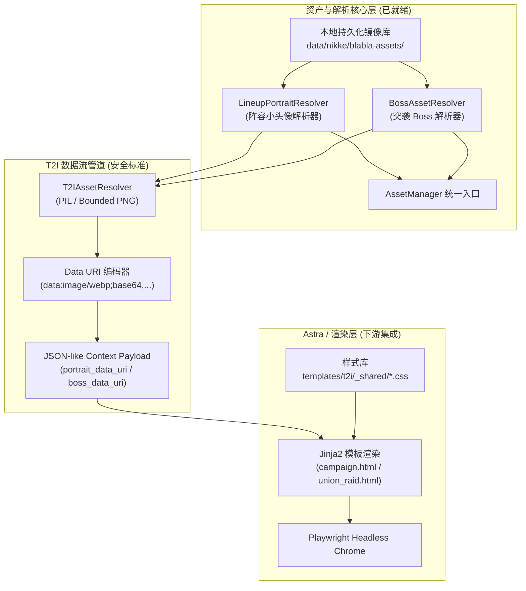

# T2I 静态资源交付与对接契约文档（面向 Astra / 下游开发）

本文档为前端模板与 T2I 视觉渲染开发（Astra）提供直接接入指引。
**Astra 严禁且无需研究 BlaBlaLink 远端 CDN 算法、大素数桶路径计算、MD5 散列或鉴权机制。**
所有静态素材均已在本地完成镜像固化，上层业务通过标准 Resolver 与 `AssetManager` 进行纯本地、零网络调用。

---

## 1. 架构分工边界



- **Astra 的职责**：
  - 专注于 HTML/CSS 视觉排版、流式布局、卡片美学与 Playwright 图像导出。
  - 在 Jinja2 模板中直接消费 `portrait_data_uri` / `boss_data_uri` 等 JSON-like 字段。
- **Astra 严禁的操作（强制安全红线）**：
  - **严禁在 Jinja 中使用 `{{ slot.portrait.local_path }}` 或引用本地文件路径**。
  - **最终生成的 HTML 中严禁出现 `file://`、绝对本地文件路径或相对本地文件系统路径**。所有图像素材必须通过 `T2IAssetResolver` 转换为内联 Data URI。
  - **严禁引入 Tailwind CSS runtime、Vite 或 Node.js 依赖**。所有卡片前端不依赖任何 Node 构建链，统一使用现有 `templates/t2i/_shared/*.css` 及普通 CSS 类名。
  - 严禁在 HTML/CSS 或模板中硬编码远程 HTTP(S) CDN 地址。
  - 严禁自行拼接文件名或在模板内进行算术 ID 猜测。

---

## 2. 阵容小头像接入契约 (Lineup Compact Portrait)

用于战役通关卡、竞技场阵容卡、公会突袭出刀编队中的 5 人小头像插槽。

### 2.1 规格参数
- **资产家族**：`si` 家族（BlaBlaLink 官方紧凑头像）
- **尺寸规格**：`128 x 128` 像素（RGBA）
- **格式**：WebP / PNG
- **镜像状态**：全量 200 款基础 NIKKE + 178 款官方换装皮肤，**100% 本地镜像已收录**。

### 2.2 Python 调用方式

#### 方式 A：通过 `AssetManager`（推荐，保持接口统一）
```python
from astrbot_plugin_nikke.asset_manager import AssetManager

# 1. 直接获取 PIL RGBA 图像（用于 Pillow 合成）
avatar_img = asset_manager.get_lineup_portrait(tid=101001, costume_id=10001)

# 2. 获取完整 Resolution 契约对象（用于 HTML 模板渲染）
resolution = asset_manager.resolve_lineup_portrait(tid=101001, costume_id=10001)
print(resolution.local_path)      # Path: d:/.../data/nikke/blabla-assets/character/si/si_c082_01_s.webp
print(resolution.is_fallback)     # bool: False
print(resolution.character_name)  # str: "Liter"
```

#### 方式 B：直接调用 `LineupPortraitResolver`
```python
from astrbot_plugin_nikke.lineup_portrait_resolver import LineupPortraitResolver

resolver = LineupPortraitResolver()
res = resolver.resolve(tid=101001, costume_id="10001")
```

### 2.3 `LineupPortraitResolution` 字段说明
| 字段 | 类型 | 说明 |
| :--- | :--- | :--- |
| `local_path` | `Path` | 本地磁盘绝对路径（如果兜底则指向 `default_avatar.webp`） |
| `relative_uri` | `str` | 相对 URI（如 `/character/si/si_c010_00_s.webp`） |
| `is_fallback` | `bool` | 是否触发了兜底（未找到该皮肤或未找到该角色） |
| `fallback_reason`| `str \| None`| 兜底原因（如 `COSTUME_ID_999_NOT_FOUND`） |
| `character_id` | `int \| None` | 角色 TID |
| `resource_id` | `int \| None` | 角色基础资源编号（如 `82`） |
| `costume_index` | `int` | 最终采用的皮肤序号（原皮为 0） |
| `character_name` | `str` | 角色名（如 `Liter`） |
| `dimensions` | `tuple[int, int]` | 固定为 `(128, 128)` |

### 2.4 推荐 HTML / CSS 结构（对齐 templates/t2i/_shared/*.css）

前端卡片不使用 Tailwind runtime。请使用项目内既有的 `templates/t2i/_shared/*.css` 基础样式与原生 CSS 类：

```html
<!-- 阵容单人插槽 (Jinja 模板严格消费 Data URI，严禁 local_path) -->
<div class="lineup-slot">
    <!-- 头像容器：圆形遮罩与战术光圈 -->
    <div class="avatar-wrapper">
        
        <!-- 爆裂阶段角标 (Burst) -->
        <span class="burst-badge burst-{{ slot.burst_type | lower }}">
            {{ slot.burst_type }}
        </span>
    </div>
    <!-- 角色名称与战力 -->
    <div class="character-name">{{ slot.name }}</div>
    <div class="character-level">Lv.{{ slot.level }}</div>
</div>
```

---

## 3. Union Raid Boss 图像接入契约

用于公会战（联盟突袭）总览卡片中的 Boss 面板卡。

### 3.1 规格参数
- **资产家族**：`monster_full` 家族（BlaBlaLink 官方突袭 Boss 卡大图）
- **尺寸规格**：`1024 x 1024` 像素（RGBA WebP，全高清真彩素材）
- **格式**：WebP / PNG
- **镜像状态**：已验证赛季（35-40）所有 23 款独特 Boss 官方大图 **100% 镜像收录于本地**。
- **降级保护**：当该期突袭未收录或 Boss 图片缺失时，返回 **战术 Boss 剪影占位图** (`default_boss.webp`)，保证页面永远不会出现裂图或空白。

### 3.2 T2I 数据流水线 (Data URI Pipeline)

T2I 渲染层不直接在 HTML 中引用文件路径，而是严格遵循以下数据流水线：

```text
Resolver (BossAssetResolver / LineupPortraitResolver)
→ local Path / PIL.Image
→ T2IAssetResolver
→ Bounded PNG / WebP
→ Data URI (data:image/webp;base64,...)
→ JSON-like Context Payload (boss_data_uri / portrait_data_uri)
→ Jinja2 Template
```

Python 侧渲染上下文组装示例：
```python
from astrbot_plugin_nikke.boss_asset_resolver import BossAssetResolver
# Downstream T2I resolver converting local asset to base64 Data URI
# res = boss_resolver.resolve(boss_id="2420020214")
# boss_data_uri = t2i_resolver.to_data_uri(res.local_path)
# payload = {"bosses": [{"name": res.boss_name, "boss_data_uri": boss_data_uri, ...}]}
```

### 3.3 推荐 HTML / CSS 结构（对齐官网 Boss 卡片）
官网 Boss 面板采用将 Boss 全身图以 `16%` 低透明度垫在背景的战术风格：
```html
<!-- Boss 面板 (使用 templates/t2i/_shared/*.css，严禁 Tailwind 与 local_path) -->
<div class="boss-panel">
    <!-- 背景 Boss 大图 (对齐官网 opacity-16% 战术底纹，直接通过 Data URI 载入) -->
    

    <!-- 前景内容 -->
    <div class="boss-content">
        <div class="boss-header">
            <div class="boss-title-wrap">
                <span class="boss-index-badge">#{{ boss.index }}</span>
                <span class="boss-title">{{ boss.name }}</span>
            </div>
            <div class="boss-hp-text">剩余 HP: {{ boss.hp_formatted }}</div>
        </div>
        <!-- 血条及弱点属性等组件 -->
    </div>
</div>
```

---

## 4. UI 与通用图标资产速查表 (Common Icons)

以下图标已 100% 镜像至本地 `data/nikke/blabla-assets/`，通过 `AssetManager` 直接获取，不再发起任何外网请求：

| 类别 | 检索 Key | 本地文件路径 | 尺寸 | 获取方法 |
| :--- | :--- | :--- | :--- | :--- |
| **属性 (Element)** | `fire`, `water`, `wind`, `iron`, `electronic` | `icon/element/icon-code-{element}.png` | 63x73 | `asset_manager.get_element_icon(elem)` |
| **武器 (Weapon)** | `ar`, `mg`, `rl`, `sg`, `smg`, `sr` | `icon/weapon/icon-weapon-{weapon}.png` | 80x80 | `asset_manager.get_weapon_icon(wep)` |
| **企业角标 (Corp Badge)** | `elysion`, `missilis`, `tetra`, `pilgrim`, `abnormal` | `icon/atlas_common_corp/icn_corp_{01..05}.webp` | 128x128 | `asset_manager.get_corporation_icon(corp)` |
| **企业高清大标 (Corp Logo)** | `elysion`, `missilis`, `tetra`, `pilgrim`, `abnormal` | `icon/atlas_common_corp/img_logo_{corp}.webp` | 400x400 | `asset_manager._load_cached("icon/atlas_common_corp/img_logo_{corp}.webp")` |
| **爆裂阶段 (Burst)** | `step1`, `step2`, `step3`, `allstep` | `icon/atlas_common_class/icn_burst_{01..03,all}.webp` | 128x128 | `asset_manager.get_burst_icon(burst)` |
| **品级徽章 (Grade)** | `R`, `SR`, `SSR` | `icon/atlas_common_grade/ele_grade_icon_{001..003}.webp` | 188x73 | `asset_manager._load_cached("icon/atlas_common_grade/ele_grade_icon_{001..003}.webp")` |
| **职业图标 (Class)** | `attacker`, `defender`, `supporter` | `icon/atlas_common_class/icn_class_{class}.webp` | 256x256 | `asset_manager._load_cached("icon/atlas_common_class/icn_class_{class}.webp")` |
| **装备图标 (Equip)** | 72 款官方 T9/Module 装备 | `icon/equip/icn_equipment_*.webp` | 128x128 | `asset_manager.get_equipment_icon(slot, equip_id)` |

---

## 5. 性能预算与硬性红线

1. **零网络红线 (Zero Network Call)**：
   渲染器在组装 Jinja2 Context 或渲染 Pillow/Playwright 时，严禁包含任何会引发 HTTP 外部连接的逻辑。所有素材必须保证毫秒级本地命中。
2. **零崩溃红线 (Fail-Safe)**：
   即使遇到未知角色 ID、失效皮肤 ID 或完全损坏的图片文件，Resolver 绝不抛出异常中断渲染，必须统一降级至 `default_avatar` / `default_boss`。
3. **响应时间预算**：
   单张 5 人阵容卡片的所有头像解析总耗时必须控制在 `< 5ms` 内。

---

## 6. Character 官方立绘接入契约 (Local Pre-rendered Spine Portrait)

用于个人名片、角色详情卡、养成进度总览等大卡片的主视觉立绘。

### 6.1 架构流水线
Astra 在生成 Character 原生 T2I 预览时，**严禁自行读取文件系统、手动解析 manifest、计算哈希或直读 Spine 源文件**。统一通过现有标准流水线安全获取：

```text
AssetManager.get_character_portrait(name_code, resource_id, costume_id)
↓
Verified local RGBA PIL.Image (已通过 Manifest v2 与真实 SHA-256 校验)
↓
T2IAssetResolver
↓
Bounded Data URI (data:image/png;base64,...)
↓
Character Context Payload (portrait_data_uri)
↓
Jinja2 Template (templates/t2i/character.html)
```

### 6.2 规格与安全契约
- **资产目录**: `assets/spine-rendered/{spine_asset_id}.png`
- **校验规范**: `assets/spine_manifest.json` (Schema v2，严格 SHA-256、尺寸、PNG魔数核验与路径穿越防护)
- **已核验预渲染角色**:
  - `c010`: 拉毗 (Rapi, resource_id=10, 默认原皮)
  - `c010_02`: 拉毗 (Rapi, 服装: White Promise, costume_id=20001)
  - `c010_03`: 拉毗 (Rapi, 服装: Classic Vacation, costume_id=10005)
  - `c017`: 阿妮斯：超级巨星 (Anis: Star, resource_id=17, 默认原皮)
  - `c234`: 桃乐丝：机缘巧遇 (Dorothy: Serendipity, resource_id=234, 默认原皮)
  - `c330`: 皇冠 (Crown, resource_id=330, 默认原皮)
  - `c352`: 海伦 (Helm, resource_id=352, 默认原皮)
  - `c471`: 白雪公主：重型武装 (Snow White: Heavy Arms, resource_id=471, 默认原皮)
- **安全降级**: 未预渲染或校验未通过的角色统一 fail-closed 返回战术程序占位图 (`AssetManager.fallback("portrait")`)，热路径严禁发起动态 Worker 渲染或网络拉取。
