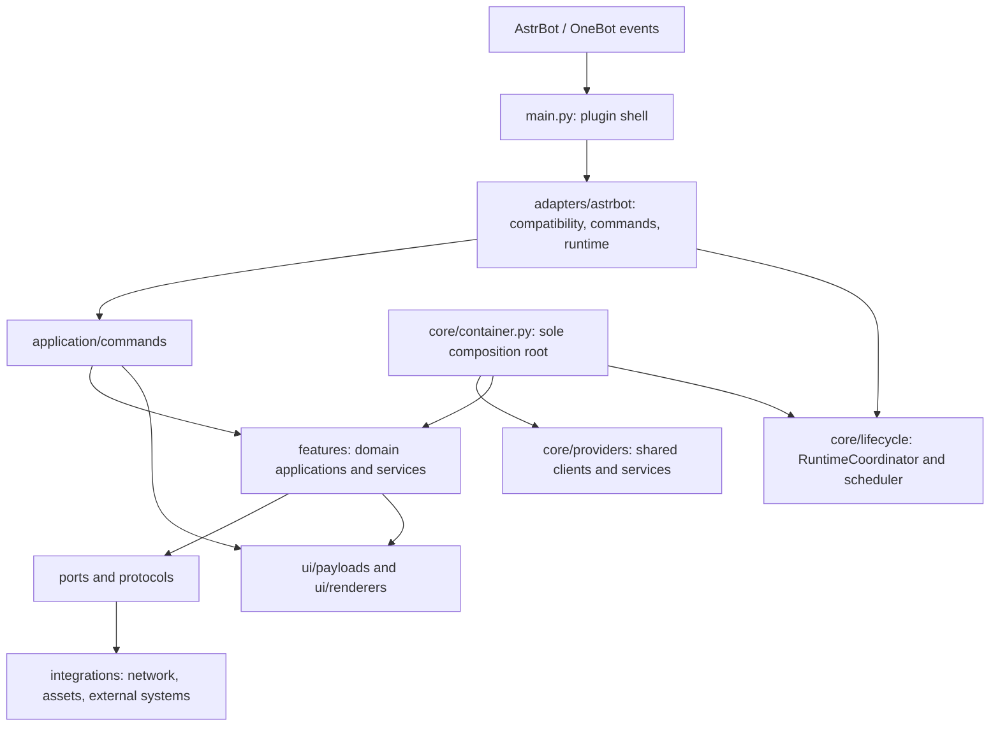

# 整仓结构重构交付记录

状态快照：2026-09-23。本记录收口 PR #103 的命令架构、兼容边界和 R24 交付证据。只有 clean final HEAD 的源码 manifest、架构 snapshot 与 final audit 全部复验后，才签发 `FULL_REFACTOR_LOCAL_COMPLETE`；该标记不代表真实账号验收、部署或稳定观察完成。权威逐文件哈希和最终 HEAD 由 run ledger 与外部 manifest 记录，见下文生成说明。

## 范围与兼容性

- 目标 PR：[#103](https://github.com/September6969/astrbot_plugin_nikke/pull/103)，标题 `refactor: reorganize plugin commands, resources, and services`；目标分支 `main`，当前分支 `refactor/full-repository`。
- PR 基线：`771f43eec6ae74f88120748eebd353a5e1d525fe`。本轮开始时 PR head 为 `c49943c89551ac7ecee4f5853720badd6e5e8cc9`；不得将其当作本轮最终 head。最终 head 以 `source_manifest.pr103-final.json` 的 `head_sha` 和 run ledger 为准，并以 `git rev-parse HEAD` 复验。
- 原整仓迁移基线 `92951b49efbf4205453391f6331cc57b1e807803` 仅用于历史 R00–R23 迁移台账；当前 PR 指标对比统一采用 PR merge-base `771f43e...`。
- AstrBot 支持合同：`>=4.24,<5`。启动前检查宿主 distribution 版本；无法确定、版本无效、低于 4.24 或达到 5.x 会明确拒绝加载。兼容实现位于 `adapters/astrbot/compatibility.py`。
- AstrBot 4.24.0 要求 Python `>=3.12`，因此 Python 3.10/3.11 不能与本插件当前 AstrBot 合同组合使用；该兼容范围由用户明确选择保留。参考 [AstrBot 4.24.0 发行元数据](https://pypi.org/project/AstrBot/4.24.0/)。
- 当前运行无法独立验证实际模型和推理强度；状态保持 `UNVERIFIED`，不以模型身份作为代码验收证据。

## PR #103 最终闭环

最终证据输出到 `E:/DevCache/nikke-full-refactor-runs/20260922T183526Z-719f5639/`，与源码仓库分离。`source_manifest.pr103-final.json` 以整仓迁移基线 `92951b49...` 为范围，覆盖其中全部改动并包含 PR base `771f43e...` 到最终 head 的改动；逐项记录原始字节 SHA-256、删除 tombstone、canonical manifest SHA 与 `head_sha`。`architecture-current-pr103-final.json` 记录同一 clean HEAD 的模块、导入边、循环及门禁；`state.json` 和 `logs/pr103_final_audit.log` 记录最终验证和审计。按 R24 的产物规则，运行产物不全部提交。复验步骤：

```powershell
$runDir = 'E:\DevCache\nikke-full-refactor-runs\20260922T183526Z-719f5639'
$manifest = Join-Path $runDir 'source_manifest.pr103-final.json'
git status --short
git rev-parse HEAD
Copy-Item (Join-Path $runDir 'source_manifest.r23.json') $manifest
python (Join-Path $runDir 'write_source_manifest.py') --repo $PWD --manifest $manifest
python (Join-Path $runDir 'scripts/verify_source_manifest.py') --repo $PWD --manifest $manifest --expected-head (git rev-parse HEAD)
python scripts/architecture_metrics.py --check --output (Join-Path $runDir 'architecture-current-pr103-final.json')
```

最终架构指标（同一版 `scripts/architecture_metrics.py` 对 PR base 与最终 clean HEAD 计算）：

| 指标 | PR base `771f43e` | final HEAD | 变化 |
|---|---:|---:|---:|
| Python 源文件 | 327 | 462 | +135 |
| 生产模块 | 124 | 224 | +100 |
| 内部导入边 | 685 | 1215 | +530 |
| 导入循环 | 1 | 0 | -1 |
| 架构门禁违规 | 76 | 0 | -76 |
| `main.py` | 2051 行 | 471 行 | -1580 |
| `adapters/astrbot/command_runtime.py` | 不存在 | 368 行 | 新增受限路由器 |
| `core/asset_manager.py` | 1328 行 | 280 行 | -1048 |
| `ui/t2i_payloads.py` | 1147 行 | 已删除 | 删除 |
| `features/calendar/schedule_service.py` | 1156 行 | 241 行 | -915 |
| `features/announcement/service.py` | 978 行 | 165 行 | -813 |
| `core/container.py` | 244 行 | 216 行 | -28 |

PR 起始 head `c49943c` 中 `command_runtime.py` 为 906 行，本轮缩至 368 行；`main.py` 从该提交的 362 行增至 471 行，是将 handler/presentation 依赖在插件启动时显式装配，而不是把领域编排留在 runtime。仍低于 700 行门槛。最终 metrics 的 `git_dirty=false`、`import_cycles=[]`、`gate_violations=[]` 是最终审计条件，不沿用任何历史 checkpoint 数值。

### 命令调用链与所有权

| 命令 | 实际调用链（省略统一的消息转换） | 结果呈现 |
|---|---|---|
| help | AstrBot event → `NikkePlugin.nikke` → `NikkeCommandRuntime` | 适配器直接返回纯文本 |
| account | runtime → `AccountCommandHandler` → account/store port | AstrBot command adapter |
| profile / me | runtime → `ProfileCommandHandler` → `ProfileApplication` → profile feature | presenter → T2I/Pillow → command adapter |
| character / roster / info | runtime → `CharacterCommandHandler` → `CharacterApplication` → character feature | 注入的 presentation callback；失败回退复用已取得 DTO |
| campaign | runtime → `CampaignCommandHandler` → `CampaignApplication` → campaign feature | 注入的 presentation callback；T2I/Pillow 不重复查询 |
| raid overview / ranking / member | runtime → `RaidCommandHandler` → `RaidApplication` → raid feature | 注入的 presentation callback或同一 DTO 文本回退 |
| tower | runtime → `TowerCommandHandler` → tower application/registry | command adapter |
| guide | runtime → `GuideCommandHandler` → guide application | command adapter |
| tarot | runtime → `TarotCommandHandler` → tarot service | command adapter |
| daily | runtime → `DailyCommandHandler` → `DailyRunner` / daily feature | command adapter；调度仍由统一 runtime owner 驱动 |
| CDK | runtime → `CdkCommandHandler` → `CdkService` / CDK feature | command adapter |
| calendar | runtime → `CalendarCommandHandler` → `CalendarApplication` → calendar feature | calendar payload + presentation callback |
| announcement | runtime → `AnnouncementCommandHandler` → `AnnouncementApplication` → announcement feature | command adapter；推送状态由 announcement delivery owner 管理 |
| voice | `NikkePlugin.on_nikke_poke` → `AstrBotVoiceAdapter` → `VoiceApplication` | adapter 转成 AstrBot Record/Message |

`NikkeCommandRuntime` 只做中文/英文/`#妮姬` 前缀解析、旧平铺别名和 handler 路由。T2I/Pillow 选择、fallback 与 AstrBot context 专属发送收敛在 `AstrBotCommandPresentation`；Character、Raid、Campaign 的 use-case 编排与 CookieExpired 映射位于各自 command handler。`core/container.py` 仍是唯一 `ServiceContainer`/`create_container` composition root；插件只一次性装配 handlers/presenters。插件级后台任务仍经 `RuntimeCoordinator` 登记、取消、等待和清理。

### 兼容与依赖

- `NikkePlugin.__getattr__` 与 `NikkeCommandRuntime.__getattr__` 已移除；内部调用使用显式 `handlers`、`adapters`、`services`、`runtime` 属性，不做双向动态 service lookup。
- 唯一 class-level `__getattr__` 兼容例外是 `AnnouncementService` 的 `_COMPAT_STATE` 明确集合成员检查；architecture gate 同时核对该 allowlist 与 `AttributeError` 路径，禁止任意属性透传。
- `adapters/astrbot/compatibility.py` 直接使用 `packaging`，故 `requirements.txt` 显式声明 `packaging>=23.2,<27`，不依赖 AstrBot 的传递依赖。AstrBot 的支持范围仍为 `>=4.24,<5`，Python 最低版本为 `>=3.12`。
- Daily 保持稳定游戏身份与旧 QQ 范围保护，`UNKNOWN_AFTER_ACTION` / cancelled write 不重放，自动偏好和真实签到默认关闭，手动/自动结果缓存范围分离。
- CDK 保持稳定 account key、哈希持久键、发送前 `DISPATCH_INTENT`、未知结果禁止重发、同账号互斥和默认关闭；明文码不写入持久化或日志。
- Announcement 保持 sender 前持久化 intent、孤立 intent 恢复为 `UNKNOWN_AFTER_ACTION` 且不自动重放、确认失败才允许延迟重试、默认关闭且必须订阅；单进程执行假设继续明确。
- DB schema 未改变，`SCHEMA_VERSION=2` 与 `accounts`、`settings`、`action_runs`、`bind_sessions`、`schema_meta` 兼容面保持；迁移、Fernet key 与数据库/密钥配对合同由现有 storage 回归覆盖。
- 插件级 background task 仍统一交给 `RuntimeCoordinator`，关闭顺序为停止新任务、取消并等待任务、按逆序清理资源。AssetManager 仍是 facade/shared resource owner，下载、缓存、Spine manifest 与 c018 framing 合同未回退。
- 未开启真实写操作；未使用真实账号，未发送 QQ 消息，未运行签到或 CDK 兑换，未部署。

## 最终架构



### 入口与所有权

| 边界 | 唯一/主要所有者 | 责任 |
|---|---|---|
| 宿主注册与事件适配 | `main.py`、`adapters/astrbot/` | 插件注册、版本门禁、消息与宿主生命周期转换；不再复制领域服务实现 |
| 命令入口 | `application/commands/` | 将命令输入转换为领域应用调用及稳定结果 |
| 组合根 | `core/container.py` | 唯一 `ServiceContainer` 和 `create_container`，连接 providers、features 与运行时 |
| 共享客户端/资产 owner | `core/providers/shared.py` | 构造共享 `BlaBlaClient`、`AssetManager` 与 `RuntimeCoordinator` |
| 后台任务生命周期 | `core/lifecycle/coordinator.py`、`scheduler.py`；宿主接口为 `adapters/astrbot/runtime.py` | 统一登记、取消、等待与关闭后台任务 |
| 领域逻辑 | `features/<domain>/` | 账号、角色、日历、公告、CDK、签到、突袭等业务规则与应用服务 |
| 外部访问 | `integrations/` | 网络、图像/Spine、静态数据与外部存储适配，通过窄接口供领域使用 |
| 展示 | `ui/payloads/`、`ui/renderers/` | 视图数据与绘制；不持有数据库、网络客户端或宿主事件 |
| 公告写入状态 | `features/announcement/delivery.py` | `DISPATCH_INTENT` 先持久化；未知结果进入 `UNKNOWN_AFTER_ACTION`，启动恢复禁止自动重放 |

## 规模与依赖变化

以下表格是 R00 至 R23 的历史对比，不代表 PR #103 当前 head；当前值见上面的“PR #103 最终闭环”表。导入边上升反映生产模块拆分后的显式内部连接，不等于门禁退化。

| 指标 | R00 基线 | R23 checkpoint | 变化 |
|---|---:|---:|---:|
| Python 源文件 | 335 | 455 | +120 |
| 生产模块 | 127 | 221 | +94 |
| 内部导入边 | 701 | 1183 | +482 |
| 导入循环 | 1 | 0 | -1 |
| 架构门禁违规 | 77 | 0 | -77 |
| `main.py` | 2067 行 | 362 行 | -1705 |
| `core/asset_manager.py` | 1328 行 | 280 行 | -1048 |
| `ui/t2i_payloads.py` | 1036 行 | 已删除 | 删除 |
| `features/calendar/schedule_service.py` | 1156 行 | 241 行 | -915 |
| `features/announcement/service.py` | 978 行 | 165 行 | -813 |
| `core/container.py` | 255 行 | 216 行 | -39 |

R23 历史结构快照是 `architecture-current-r23-final.json`：455 files、221 production modules、1183 imports、0 violations、0 cycles，绑定 HEAD `40793851823e19b087ebc84db25228afc268b2c0`。该值仅保留作历史记录，不代替 PR #103 最终 snapshot。

## 迁移台账

R00/R01 是恢复基线和架构门禁建设；以下 R02–R23 均有生产路径修改与消费者切换证据，不以单加测试或文档代替迁移。

| 卡 | 生产代码迁移、消费者切换与删除结果 | checkpoint |
|---|---|---|
| R02 | Guide/Tarot 命令切换到 framework-free handlers 与 AstrBot adapter，验证真实 SDK 消息边界 | `0ad14c0` |
| R03 | Profile 单路径：handler → application → presenter；删除 legacy builder/gateway 分支和临时开关 | `bc222a1` |
| R04 | 账号、绑定、状态和管理命令迁入 Account handler/application；Web 存储消费者切换为窄 Protocol | `9c430f0` |
| R05 | Campaign、Tower 与 Guide/Tarot 命令接入正式领域应用与 payload 边界 | `8d05cc7` |
| R06 | Raid/Union Raid 查询编排和 overview/ranking/member payload 实际迁移 | `7a351a7` |
| R07 | CharacterApplication 与 Character payload 接管 roster/character/info/progress 消费者 | `1276c03` |
| R08 | Daily/Claim/CDK 手动、批量、自动入口改走 handlers；写操作采用 intent 与未知结果禁止重放 | `f28d1a8` |
| R09 | Calendar 查询和显式刷新迁入应用服务，日历 payload 迁至 `ui.payloads.calendar` | `5f17b84` |
| R10 | Announcement 查询、重扫、订阅与投递改由唯一 AnnouncementApplication/handler 编排 | `b6c92e1` |
| R11 | VoiceApplication 持有资源选择和关闭；AstrBotVoiceAdapter 只转换事件与 Record | `9804945` |
| R12 | RuntimeCoordinator/Scheduler 接管后台任务创建、关闭与宿主周期调度，删除 main 中旧生命周期实现 | `36d3909` |
| R13 | 拆分共享 T2I payload helper，所有消费者切换后删除 `ui/t2i_payloads.py` | `d6728e9` |
| R14 | AssetManager 缓存、下载、manifest、解析与生命周期责任拆分；消费者不再构造第二个 owner | `cadd8e5` |
| R15 | Calendar query/refresh/merge/time/snapshot 协作者分离，唯一状态 resolver 被多个消费者复用 | `3de9822` |
| R16 | AnnouncementService normalization、repository/cache、sync、query、diagnostics、deadline parser 拆分；delivery 保持单一状态机 | `ece3b19` |
| R17 | Character request/result、应用依赖、builder ports、composition 和资产 DTO 边界落地 | `a85d47e` |
| R18 | 持久化 Protocol 归属消费者；CDK key/state 语义移出 NikkeStore，保持 schema/key/备份合同 | `ca01364` |
| R19 | 领域 providers 拆分；唯一 composition root 装配显式 handler/adapter collection，移除服务别名 | `a2e6e39` |
| R20 | `main.py` 收敛为宿主壳；命令解析/编排迁出并生成可核对的入口映射 | `23b043c` |
| R21 | 删除无消费者的 Spine re-export、enqueue forwarder、Profile 双实现及脚本 fallback；保留项有范围/期限 | `747098f` |
| R22 | 跨层网络/图像依赖迁至 integrations 并通过 ports 注入；删除无消费者旧 source/crop 路径 | `039f25d` |
| R23 | 新增并接入 AstrBot 版本兼容 adapter；无效宿主在 Star 初始化之前被拒绝，范围与 metadata 一致 | `4079385` |

### 删除清单

R00 基线至 R23 manifest 记录的 9 个删除项（raw-byte tombstones）：

- `experimental/__init__.py`
- `experimental/spine_prerenderer.py`
- `features/calendar/sources.py`
- `features/calendar/visuals.py`
- `features/character/crop.py`
- `features/character/stat_resources.py`
- `features/voice/provider.py`
- `tests/test_character_crop.py`
- `ui/t2i_payloads.py`

此外，各迁移卡记录消费者替换和内部旧入口移除。根容器历史兼容 shim 与持久化状态/schema 兼容属于显式保留项，不应与“无消费者的内部路径”混淆；范围和期限见 R21/R18 证据。

## 验证证据

- 本轮 Python 3.14.5 本地完整 pytest：`1338 passed, 2 skipped, 651 subtests passed`。本机版本不属于插件支持矩阵；AstrBot/Python 正式支持矩阵由远端 CI 验证。
- 定向 architecture、main routing、AstrBot adapter、命令合同、lifecycle、storage、Daily、CDK、Announcement、Calendar、Character、Raid、Campaign、c018 与 Spine manifest：`358 passed, 229 subtests passed`；另复验旧入口迁移合同 `12 passed`。
- `mypy 2.3.1` 正式配置：37 source files 无错误；`compileall`、包与 compatibility import、`git diff --check`、`architecture_metrics.py --check` 均通过。
- CI 同款本地命令 `node --test tests/extension.test.cjs`：Node v24.15.0，4 passed。Node 22 与 Linux Spine headless worker 单列由 G01 远端 workflow 验证。
- c018 framing contract、Spine render manifest、T2I/Pillow fallback、fallback 不重复请求、CookieExpired 失效处理、delayed feedback 取消和三类写入 crash contract 均由对应定向/全量测试覆盖。
- 旧 R23 manifest 仅作历史证据；PR #103 final manifest 使用 run 工具重新生成，不复用 `4079385...`、`3a44c...` 或 `c49943c...` 的指纹冒充最终版本。

## 恢复与回退说明

1. 操作前先保存 `git status --short`、当前 HEAD 和未提交 patch；不要对未知工作树执行 `reset --hard`、`clean` 或覆盖式 checkout。
2. 对比 R22 可在独立目录创建 worktree：`git worktree add <new-directory> 039f25da516ec760a559bbe806a23ec97e7f5e43`。保持 `refactor/full-repository` 原分支不变。
3. R23 兼容入口的变更单独位于 `40793851823e19b087ebc84db25228afc268b2c0`；如需撤销，应先 review `git show`，再以新的 revert commit 回退，不改写既有 checkpoint 历史。
4. 插件运行数据不属于源码恢复包。数据库 `nikke.sqlite3` 与 `secret.key` 必须成对备份；只运行只读 upgrade preflight，除非另行取得授权，不执行真实数据恢复或删除。备份规则见 [`UPGRADE_ROLLBACK_PREFLIGHT_ACCEPTANCE.md`](../acceptance/UPGRADE_ROLLBACK_PREFLIGHT_ACCEPTANCE.md)。
5. 本轮 R24 run ledger、raw manifest、架构 snapshot 和 final audit 存放于 `E:/DevCache/nikke-full-refactor-runs/20260922T183526Z-719f5639/`，与源码仓库分离；每次使用前都要核对 manifest 的 `head_sha` 与当前 `git rev-parse HEAD`。

## PR #103 的评审边界

PR #103 已承载整仓迁移。本表是评审导航，不代表拆分或合入其他 PR；PR #101 仍为独立 scope：

1. **命令与领域入口**：R02–R10，按 Profile/account、Raid/Character、Daily/CDK、Calendar/Announcement 分组；每组包含命令映射、写入合同和相应回归。
2. **Voice、生命周期与资源/UI**：R11–R14，先合入应用/adapter 生命周期，再合入 payload 与 AssetManager 分责。
3. **领域服务与持久化**：R15–R18，Calendar、Announcement、Character 和 persistence ports 分别拆开，便于审查数据兼容边界。
4. **整合与依赖收敛**：R19–R22，composition root、main shell、旧路径删除和 feature/integration 方向可分为两到三份 PR。
5. **宿主兼容与验收**：R23，单独 review AstrBot version gate、最低版本矩阵、CI 和完整回归证据。

评审应按消费者边界、测试和迁移风险逐段核对；不能把尚未执行的真实验收、部署或稳定观察包装为已验收，也不压平各迁移卡的证据。

## 外部门槛 G01–G04

| Gate | 当前状态 | 未完成边界 |
|---|---|---|
| G01 CI | `COMPLETE` | 权威 run id 与 `head_sha` 记录在独立 R24 ledger 的 `state.json.remote_ci`；final audit 强制校验 `remote_ci.head_sha == git rev-parse HEAD` 且六个 required jobs 全成功。此前 implementation checkpoint 的 run 不代替最终交付 HEAD 的 CI 证据。 |
| G02 真实验收 | `NOT_RUN` | 需要用户授权的真实账号及用户验收；本任务未写入真实账号、QQ、群消息、签到或 CDK |
| G03 部署 | `NOT_RUN` | 未授权部署；没有更改服务器、生产数据或运行服务 |
| G04 稳定观察 | `NOT_STARTED` | 仅在 G02/G03 获准并完成后才有运行观察窗口 |

G01–G04 是独立边界；真实账号验收、部署和稳定观察不因本地完成或 CI 通过而自动完成。

## R24 交付范围与完成判定

权威 `TASKS.json` 将 R24 明确列为 `DELIVERY`：范围是最终文档、README、source manifest 与 final audit，不要求添加生产代码迁移。R02–R23 的生产迁移证据仍按各自 `MIGRATE` 验收；R24 不以文档代替这些迁移。本轮 command-runtime 收口是 PR #103 用户另行明确要求的实现切片，单独记录于 `refactor(commands): split AstrBot command orchestration`，不是为 R24 标签添加的无关生产改动。

`FULL_REFACTOR_LOCAL_COMPLETE` 仅表示 R00–R24 本地证据齐全、最终源码 manifest 通过原始字节与 canonical hash 校验、架构快照绑定到干净 HEAD 且 final audit 全项通过。该状态不代表 READY_FOR_MERGE，也不代表真实账号验收、部署或稳定观察已完成；PR merge 未获授权且不执行。
