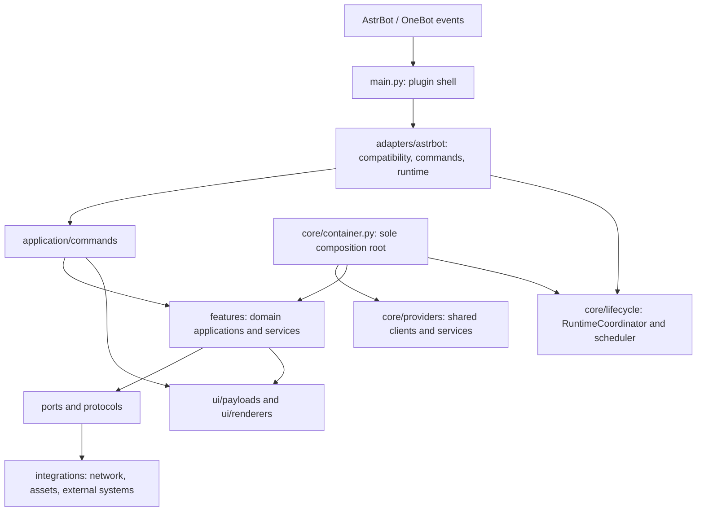

# 整仓结构重构交付记录

状态快照：2026-09-23。代码迁移 R00–R23 已通过本地验收；R24 的交付文档已整理，但其卡片类型与全局迁移约束存在冲突，因此 `FULL_REFACTOR_LOCAL_COMPLETE` 尚未签发。权威运行状态见本次 run 的 `state.json`。

## 范围与兼容性

- 隔离分支：`refactor/full-repository`；基线：`92951b49efbf4205453391f6331cc57b1e807803`。
- R23 代码 checkpoint：`40793851823e19b087ebc84db25228afc268b2c0`。R23 时工作树 clean，未 push、创建 PR、merge、发布或部署。
- AstrBot 支持合同：`>=4.24,<5`。启动前检查宿主 distribution 版本；无法确定、版本无效、低于 4.24 或达到 5.x 会明确拒绝加载。兼容实现位于 `adapters/astrbot/compatibility.py`。
- AstrBot 4.24.0 要求 Python `>=3.12`，因此 Python 3.10/3.11 不能与本插件当前 AstrBot 合同组合使用；该兼容范围由用户明确选择保留。参考 [AstrBot 4.24.0 发行元数据](https://pypi.org/project/AstrBot/4.24.0/)。
- 当前运行无法独立验证实际模型和推理强度；状态保持 `UNVERIFIED`，不以模型身份作为代码验收证据。

## 最终架构

### 入口与所有权

| 边界 | 唯一/主要所有者 | 责任 |
|---|---|---|
| 宿主注册与事件适配 | `main.py`、`adapters/astrbot/` | 插件注册、版本门禁、消息与宿主生命周期转换；不再复制领域服务实现 |
| 命令入口 | `application/commands/` | 将命令输入转换为领域应用调用及稳定结果 |
| 组合根 | `core/container.py` | 唯一 `ServiceContainer` 和 `create_container`，连接 providers、features 与运行时 |
| 共享客户端/资产 owner | `core/providers/shared.py` | 构造共享 `BlaBlaClient`、`AssetManager` 与 `RuntimeCoordinator` |
| 后台任务生命周期 | `core/lifecycle/coordinator.py`、`scheduler.py`；宿主接口为 `adapters/astrbot/runtime.py` | 统一登记、取消、等待与关闭后台任务 |
| 领域逻辑 | `features/<domain>/` | 账号、角色、日历、公告、CDK、签到、突袭等业务规则与应用服务 |
| 外部访问 | `integrations/` | 网络、图像/Spine、静态数据与外部存储适配，通过窄接口供领域使用 |
| 展示 | `ui/payloads/`、`ui/renderers/` | 视图数据与绘制；不持有数据库、网络客户端或宿主事件 |
| 公告写入状态 | `features/announcement/delivery.py` | `DISPATCH_INTENT` 先持久化；未知结果进入 `UNKNOWN_AFTER_ACTION`，启动恢复禁止自动重放 |

## 规模与依赖变化

以下来自 R00 基线 `architecture-baseline.json` 与 R23 clean checkpoint 的同一指标脚本。导入边上升反映生产模块拆分后的显式内部连接，不等于门禁退化；最终门禁和循环均为零。

| 指标 | R00 基线 | R23 checkpoint | 变化 |
|---|---:|---:|---:|
| Python 源文件 | 335 | 455 | +120 |
| 生产模块 | 127 | 221 | +94 |
| 内部导入边 | 701 | 1183 | +482 |
| 导入循环 | 1 | 0 | -1 |
| 架构门禁违规 | 77 | 0 | -77 |
| `main.py` | 2067 行 | 362 行 | -1705 |
| `core/asset_manager.py` | 1328 行 | 280 行 | -1048 |
| `ui/t2i_payloads.py` | 1036 行 | 已删除 | 删除 |
| `features/calendar/schedule_service.py` | 1156 行 | 241 行 | -915 |
| `features/announcement/service.py` | 978 行 | 165 行 | -813 |
| `core/container.py` | 255 行 | 216 行 | -39 |

R23 的精确结构快照是 `architecture-current-r23-final.json`：455 files、221 production modules、1183 imports、0 violations、0 cycles。对应 HEAD `40793851823e19b087ebc84db25228afc268b2c0`，`git_dirty=false`。

## 迁移台账

R00/R01 是恢复基线和架构门禁建设；以下 R02–R23 均有生产路径修改与消费者切换证据，不以单加测试或文档代替迁移。

| 卡 | 生产代码迁移、消费者切换与删除结果 | checkpoint |
|---|---|---|
| R02 | Guide/Tarot 命令切换到 framework-free handlers 与 AstrBot adapter，验证真实 SDK 消息边界 | `0ad14c0` |
| R03 | Profile 单路径：handler → application → presenter；删除 legacy builder/gateway 分支和临时开关 | `bc222a1` |
| R04 | 账号、绑定、状态和管理命令迁入 Account handler/application；Web 存储消费者切换为窄 Protocol | `9c430f0` |
| R05 | Campaign、Tower 与 Guide/Tarot 命令接入正式领域应用与 payload 边界 | `8d05cc7` |
| R06 | Raid/Union Raid 查询编排和 overview/ranking/member payload 实际迁移 | `7a351a7` |
| R07 | CharacterApplication 与 Character payload 接管 roster/character/info/progress 消费者 | `1276c03` |
| R08 | Daily/Claim/CDK 手动、批量、自动入口改走 handlers；写操作采用 intent 与未知结果禁止重放 | `f28d1a8` |
| R09 | Calendar 查询和显式刷新迁入应用服务，日历 payload 迁至 `ui.payloads.calendar` | `5f17b84` |
| R10 | Announcement 查询、重扫、订阅与投递改由唯一 AnnouncementApplication/handler 编排 | `b6c92e1` |
| R11 | VoiceApplication 持有资源选择和关闭；AstrBotVoiceAdapter 只转换事件与 Record | `9804945` |
| R12 | RuntimeCoordinator/Scheduler 接管后台任务创建、关闭与宿主周期调度，删除 main 中旧生命周期实现 | `36d3909` |
| R13 | 拆分共享 T2I payload helper，所有消费者切换后删除 `ui/t2i_payloads.py` | `d6728e9` |
| R14 | AssetManager 缓存、下载、manifest、解析与生命周期责任拆分；消费者不再构造第二个 owner | `cadd8e5` |
| R15 | Calendar query/refresh/merge/time/snapshot 协作者分离，唯一状态 resolver 被多个消费者复用 | `3de9822` |
| R16 | AnnouncementService normalization、repository/cache、sync、query、diagnostics、deadline parser 拆分；delivery 保持单一状态机 | `ece3b19` |
| R17 | Character request/result、应用依赖、builder ports、composition 和资产 DTO 边界落地 | `a85d47e` |
| R18 | 持久化 Protocol 归属消费者；CDK key/state 语义移出 NikkeStore，保持 schema/key/备份合同 | `ca01364` |
| R19 | 领域 providers 拆分；唯一 composition root 装配显式 handler/adapter collection，移除服务别名 | `a2e6e39` |
| R20 | `main.py` 收敛为宿主壳；命令解析/编排迁出并生成可核对的入口映射 | `23b043c` |
| R21 | 删除无消费者的 Spine re-export、enqueue forwarder、Profile 双实现及脚本 fallback；保留项有范围/期限 | `747098f` |
| R22 | 跨层网络/图像依赖迁至 integrations 并通过 ports 注入；删除无消费者旧 source/crop 路径 | `039f25d` |
| R23 | 新增并接入 AstrBot 版本兼容 adapter；无效宿主在 Star 初始化之前被拒绝，范围与 metadata 一致 | `4079385` |

### 删除清单

R00 基线至 R23 manifest 记录的 9 个删除项（raw-byte tombstones）：

- `experimental/__init__.py`
- `experimental/spine_prerenderer.py`
- `features/calendar/sources.py`
- `features/calendar/visuals.py`
- `features/character/crop.py`
- `features/character/stat_resources.py`
- `features/voice/provider.py`
- `tests/test_character_crop.py`
- `ui/t2i_payloads.py`

此外，各迁移卡记录消费者替换和内部旧入口移除。根容器历史兼容 shim 与持久化状态/schema 兼容属于显式保留项，不应与“无消费者的内部路径”混淆；范围和期限见 R21/R18 证据。

## 验证证据

- Python 3.13.13 / AstrBot 4.24.0 全量 pytest：`1317 passed, 2 skipped, 651 subtests passed`；A74 13 项覆盖在全量中通过。发送前 intent 持久化；未知结果和孤立 intent 均不自动重发。
- AstrBot 版本边界测试：5 passed/5 subtests；主入口、架构、仓库完整性、语音和公告专项合计 48 passed/156 subtests。
- Node v24.15.0 三个文件 10 passed；CI 要求的 Node 22 尚待 G01。
- mypy 2.3.1 的 32 个配置目标无错误；compileall、AstrBot API/插件导入、pip check、diff check 均通过。
- 固定视觉/像素专项 54 passed；资源 lifecycle 正常/异常关闭路径均关闭 provider 且活动任务数为 0。
- 四组性能 after 中位数均低于 before：Voice registry 93.6→36.0 μs；100KB cached source 580.65→304.9 μs；10-account list 46.59→4.54 ms；200-name map 1142.4→201.8 μs。
- R23 manifest 文件位于本次 run 的 `source_manifest.r23.json`：270 个变更路径原始字节逐项 SHA-256、9 个 tombstones、canonical hash 自校验及 clean Git 状态均通过。R24 文件提交后必须重新生成最终 manifest；不可复用 R23 指纹冒充最终指纹。

## 恢复与回退说明

1. 操作前先保存 `git status --short`、当前 HEAD 和未提交 patch；不要对未知工作树执行 `reset --hard`、`clean` 或覆盖式 checkout。
2. 对比 R22 可在独立目录创建 worktree：`git worktree add <new-directory> 039f25da516ec760a559bbe806a23ec97e7f5e43`。保持 `refactor/full-repository` 原分支不变。
3. R23 兼容入口的变更单独位于 `40793851823e19b087ebc84db25228afc268b2c0`；如需撤销，应先 review `git show`，再以新的 revert commit 回退，不改写既有 checkpoint 历史。
4. 插件运行数据不属于源码恢复包。数据库 `nikke.sqlite3` 与 `secret.key` 必须成对备份；只运行只读 upgrade preflight，除非另行取得授权，不执行真实数据恢复或删除。备份规则见 [`UPGRADE_ROLLBACK_PREFLIGHT_ACCEPTANCE.md`](../acceptance/UPGRADE_ROLLBACK_PREFLIGHT_ACCEPTANCE.md)。
5. 运行状态、raw manifest 与逐阶段证据存放于本次 `E:/DevCache/nikke-full-refactor-runs/20260922T183526Z-719f5639/`，与源码仓库分离；使用前核对 manifest 的 HEAD 与当前分支。

## 建议的 PR 边界（未创建 PR）

以下仅为后续评审切片建议，不代表已获准 push 或创建远端 PR：

1. **命令与领域入口**：R02–R10，按 Profile/account、Raid/Character、Daily/CDK、Calendar/Announcement 分组；每组包含命令映射、写入合同和相应回归。
2. **Voice、生命周期与资源/UI**：R11–R14，先合入应用/adapter 生命周期，再合入 payload 与 AssetManager 分责。
3. **领域服务与持久化**：R15–R18，Calendar、Announcement、Character 和 persistence ports 分别拆开，便于审查数据兼容边界。
4. **整合与依赖收敛**：R19–R22，composition root、main shell、旧路径删除和 feature/integration 方向可分为两到三份 PR。
5. **宿主兼容与验收**：R23，单独 review AstrBot version gate、最低版本矩阵、CI 和完整回归证据。

PR 应按各自消费者边界、测试和迁移风险拆分，不能将尚未执行的 G01–G04 包装为已验收，也不能为方便合并而压平每张卡的迁移证据。

## 外部门槛 G01–G04

| Gate | 当前状态 | 未完成边界 |
|---|---|---|
| G01 CI | `NOT_RUN_REMOTE` | Python 3.12、Node 22、远端 workflow 与 Linux Spine Docker/渲染；本地 Python 3.13/AstrBot 4.24、Node 24 的结果不冒充这些项 |
| G02 真实验收 | `NOT_RUN` | 需要用户授权的真实账号及用户验收；本任务未写入真实账号、QQ、群消息、签到或 CDK |
| G03 部署 | `NOT_RUN` | 未授权部署；没有更改服务器、生产数据或运行服务 |
| G04 稳定观察 | `NOT_STARTED` | 仅在 G02/G03 获准并完成后才有运行观察窗口 |

G01–G04 不阻止本地源码工作，但不能写成已完成。

## R24 交付范围与完成判定

权威 `TASKS.json` 将 R24 明确列为 `DELIVERY`：范围是最终文档、README、source manifest 与 final audit，不要求添加生产代码迁移。R02–R23 的生产迁移证据仍按各自 `MIGRATE` 验收；R24 不以文档代替这些迁移，也不引入无关代码改动。

本记录说明的是本地整仓交付，不代表 G01–G04 已完成。`FULL_REFACTOR_LOCAL_COMPLETE` 仅在 R00–R24 均有对应证据、最终提交的源码 manifest 通过原始字节校验、架构快照绑定到干净 HEAD 且 final audit 全项通过后成立；运行台账与 final audit 输出是该判定的权威证据。远端 CI、真实账号验收、部署和稳定观察仍保持上表所列状态，未获授权时不执行。
